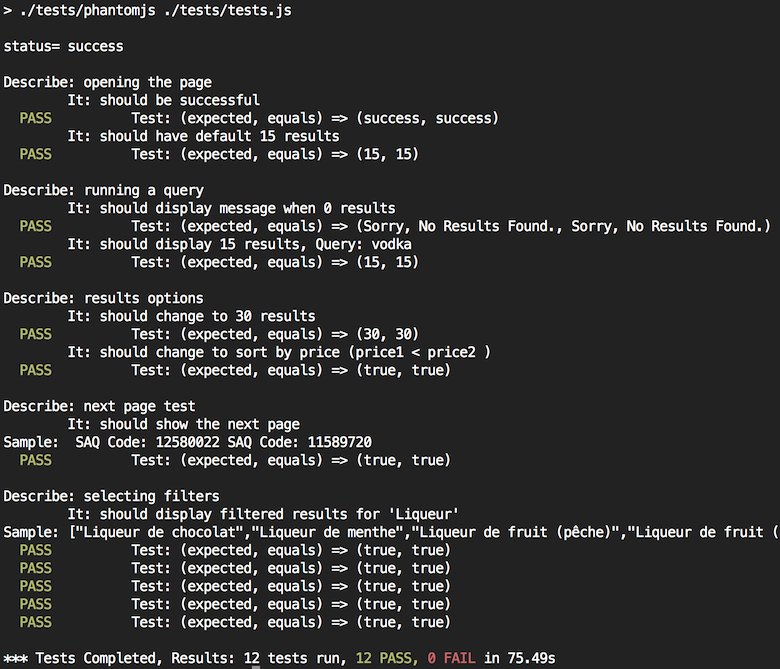

This is the Coveo REST web front-end test.

#Features
- Star icon on 75%+ relevant results
- Bounce on 'Product of Quebec'
- Market SALE items
- Filters easily added / removed in controller config
- Responsive design

# Setup
**npm install**

# Build
**npm run build** OR ./node_modules/gulp/bin/gulp.js

# Testing
To test the UI, configure the URL in /tests/tests.js (line 13) and run:

**npm test** OR ./tests/phantomjs tests.js

Sample test result

Note: PhantomJS included is for MacOSX, replace with appropriate version.

# Demo
View the live demo at http://codeeverywhere.ca/coveo-test

# Libraries
- AngularJS
- Font-Awesome
- Animate.css

# Problems
- Autosuggest service not active?
- Error in 'more' call "Invalid sort criteria: \"AlphaDescending\""?
